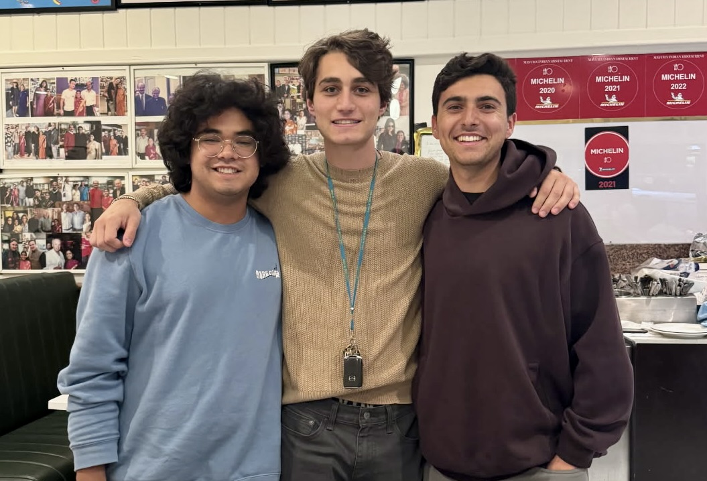

<!-- PAGE HEADER -->

  <h1>About Cultural Health Connect</h1>

  

    Cultural Health Connect was founded with the aim of bridging cultural gaps in healthcare. We are dedicated to providing culturally relevant health and lifestyle education to immigrant communities in East County San Diego. Our mission is to empower community members by integrating traditional cultural values with modern healthcare practices.
  

  <h2 class="section-heading" style="margin-top:2rem;">Our Founders & Their Mission</h2>

  

    
    
Cultural Health Connect was founded by Adam Bisharat, Alex Ottersbach, and Isaac Cesena—three friends driven by a shared commitment to improving community health through culturally grounded education. The idea first took shape when Adam was volunteering at a diabetes clinic in El Cajon, where he saw how much of a difference respectful, patient-centered care could make. The clinic met people where they were, honored their cultural diets, and preached moderation over elimination. That approach inspired Adam to think beyond the walls of the clinic. He realized the same kind of care that changed lives in one building could reach far more people if it extended into the local community.
      
    Together with Alex and Isaac, he launched Cultural Health Connect to make that vision real. The nonprofit focuses on Middle Eastern and Mexican communities in El Cajon, where chronic illnesses like diabetes and hypertension are common but often poorly addressed by mainstream health messaging. Through community polling, small business partnerships, and guidance from local physicians, the team works to offer health guidance that feels familiar, accessible, and respectful.
      
    While we believe the most impactful relationships are formed through face-to-face interactions, the advice we give can benefit anyone—and we hope this webpage can broaden our reach both in El Cajon and beyond.

  

<footer>
  © 2025 Cultural Health Connect
</footer>
